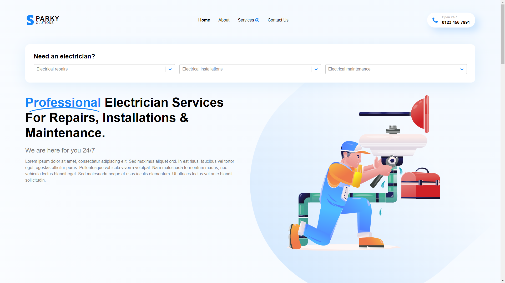
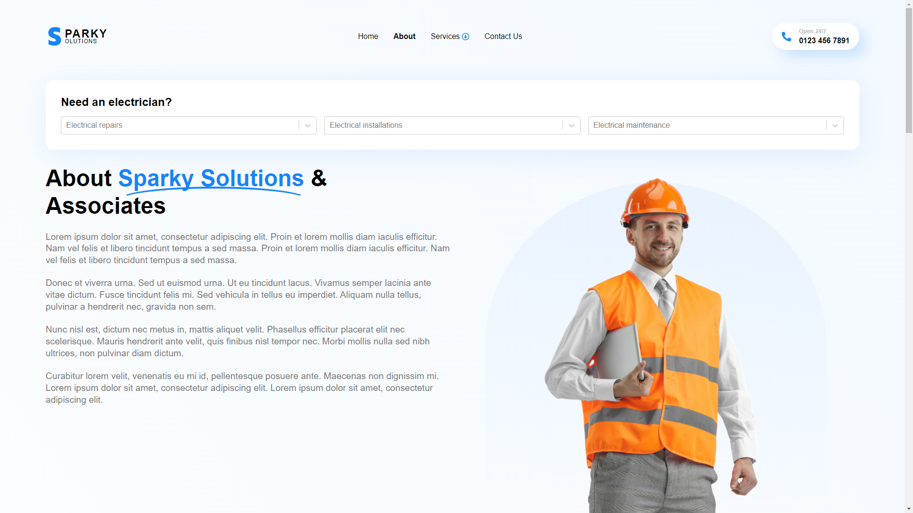
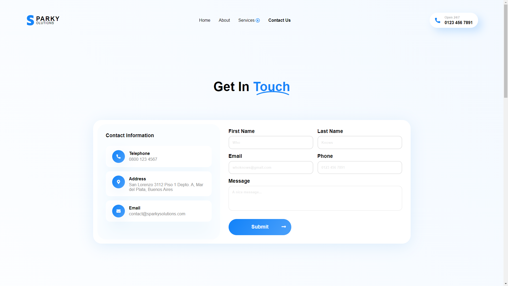

# Sparky Solutions

Welcome to the Sparky Solutions repository! This website was built using [Next.js](https://nextjs.org/) and pure CSS, with the help of the [styled components](https://styled-components.com/) library for a single reusable React component. The site is fully responsive and features three pages: home, about, and contact us. It is hosted at [https://whoknowsi.github.io/sparky-solutions/](https://whoknowsi.github.io/sparky-solutions/).

## Screenshots

### Home page

### About page

### Contact us page

## Responsive design

Sparky Solutions is designed to be responsive, adapting to different screen sizes and resolutions. Here are some examples of how the website looks on different devices:

### Desktop

### Tablet

### Mobile

## Getting Started

To get started with this project, follow these steps:

1. Clone the repository: `git clone https://github.com/whoknowsi/sparky-solutions.git`
2. Install the dependencies: `npm install`
3. Create a `.nojekyll` file in the root directory of the repository: `touch .nojekyll` (on Windows, you can use `type nul > .nojekyll`)
4. (Optional) If you want to deploy the website to GitHub Pages, update the `homepage` field in the `package.json` file to match the URL of your GitHub Pages site (e.g. `"homepage": "https://whoknowsi.github.io/sparky-solutions/"`). This field is not necessary for development or testing the site locally.
5. Start the development server: `npm run dev`

## Scripts

This project includes several scripts to help you develop, build, and deploy the website:

- `dev`: Start the development server
- `build`: Build the website for production
- `export`: Export the built website to static HTML files
- `static`: Build and export the website
- `start`: Start the production server
- `lint`: Lint the code using [ESLint](https://eslint.org/)
- `deploy`: Deploy the built website to GitHub Pages
- `deploy:full`: Build, export, and deploy the website

**Note:** The `export`, `static`, and `deploy:full` scripts require a `.nojekyll` file in the root directory of the repository. This file is used to copy the `_next` directory and its contents to the `out` directory, which is necessary for GitHub Pages to correctly import the JavaScript and CSS files when deploying the site.

**Note:** The scripts in this project are designed to work with Windows. On Linux or macOS, you may need to use a different command to create the `.nojekyll` file (e.g. `echo "" > .nojekyll`).

## Built With

- [Next.js](https://nextjs.org/) - A framework for building server-rendered React applications
- [styled components](https://styled-components.com/) - A library for styling React components with CSS
- [ESLint](https://eslint.org/) - A tool for linting JavaScript code
- [react-copy-to-clipboard](https://www.npmjs.com/package/react-copy-to-clipboard) - A React component for copying text to the clipboard
- [react-icons](https://react-icons.github.io/) - A library of SVG icons for React
- [react-select](https://react-select.com/) - A flexible and customizable select component for React

## License

This project is licensed under the MIT License - see the [LICENSE](LICENSE.md) file for details.